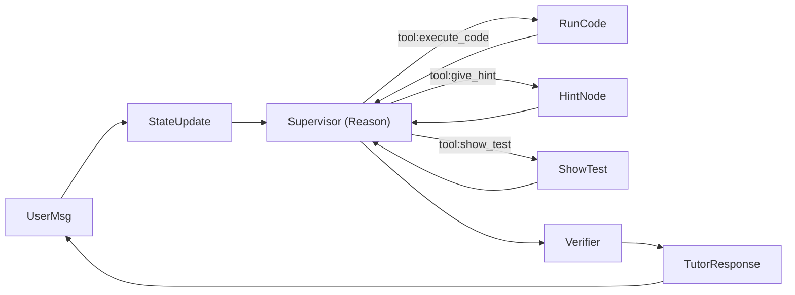

# 라이브 코딩 과외 챗봇 시나리오 (자료구조 파트)

## 0. 사전 설정
1. 사용자는 로그인 후 **이름**·**레벨(초급/중급/고급)**·**언어(파이썬/자바스크립트)**를 입력.  
2. 시스템은 웹 IDE(코드 에디터+콘솔)와 챗 패널을 좌우 분할로 로드한다.

---

## 1. 세션 오리엔테이션
| 타이밍 | 시스템(튜터) 행동 | UI 요소 |
|--------|------------------|---------|
| T0 | "안녕하세요 **{{name}}** 님! 오늘은 *스택* 구현을 연습해볼게요.\n준비되면 ‘시작’이라고 입력하세요." | 메시지 전송 후 입력창 잠금 → 5초 후 해제 |
| T1 | 사용자가 `시작` 입력 |  |
| T2 | 튜터: 과제 설명 + 요구사항(동작, 시간복잡도) + 샘플 I/O 표 | 챗 패널 + IDE 좌측 문제 탭 |

---

## 2. 인터랙티브 코딩 루프 (ReAct Supervisor 기반)


### 루프 단계 세부
1. **UserMsg**: 사용자가 IDE에 코드를 입력 후 `제출` 버튼 → 챗 입력창으로 전송.
2. **StateUpdate**: 메시지를 히스토리에 추가, 코드 스냅샷 저장.
3. **Supervisor(Planner)**: 
   - 코드 컴파일 필요 여부, 힌트 필요 여부를 Reason(CoT)로 판단.
4. **RunCode Tool**: 컨테이너에서 코드를 실행하고 결과(JSON: 성공/실패, 오류, 테스트 통과율)를 반환.
5. **HintNode**: 실패 원인 분석 → 단계적 힌트 1개 생성.
6. **ShowTest**: 통과하지 못한 테스트케이스만 선택해 사용자에게 보여줌.
7. **Verifier**: 출력 문구·힌트가 정책 위반/과도한 코드 누설이 없는지 체크.
8. **TutorResponse**: 최종 메시지 스트리밍. 필요 시 IDE에 자동으로 실패 라인 주석 삽입.

이 루프는 `모든 테스트 통과` 혹은 `제한 시간(30분)` 종료 시까지 반복한다.

---

## 3. 세션 마무리
1. 모든 테스트 통과 시 → "축하합니다! 스택 구현을 완성했어요 🎉. 오늘 배운 점을 요약해 드릴게요."  
2. 요약 메시지 + 다음 추천 과제 링크 + 개별 피드백이 표시된다.
3. 사용자는 `리뷰 저장`을 눌러 진행 상황을 DB에 저장하거나 `다음 과제`를 선택.

---

## 4. Latency 최적화 포인트
- 코드 실행은 **서버리스 컨테이너**로 병렬 스케일링, 결과를 WebSocket으로 스트리밍.  
- 챗 응답은 **Gemini Flash** 사용 + 스트리밍 첫 토큰 < 100 ms 목표.  
- 힌트·테스트 노드는 병렬 실행 후 Supervisor 로 병합.

---

## 5. 실패·에러 핸들링
| 상황 | 대응 |
|------|------|
| 컴파일 오류 | HintNode 가 오류 로그 요약, ‘컴파일러가 ___ 라고 말해요…’ 형식으로 전달 |
| 무한 루프 의심 | RunCode 가 3초 타임아웃, 힌트로 "무한 루프 가능성" 지적 |
| 정책 위반(민감 정보 포함) | Verifier 가 메시지를 블록하고 재생성 요청 |

---

## 6. 확장 아이디어
- **음성 모드**: WebRTC 로 STT → Text → 위 그래프 동일; TutorResponse 를 TTS 합성하여 재생.  
- **협업 모드**: 두 명의 학생 세션 State 를 병합해 Pair-Programming 튜토리얼.

---

## 7. 예시 대화 시나리오 (AI 튜터 × 학생 민지)
> 상황: 자료구조 ‘스택’ 구현 과제, 언어는 파이썬.

| 시점 | 화자 | 메시지/행동 |
|------|------|-------------|
| 0:00 | 튜터 | "안녕하세요 *민지* 님! 라이브 코딩 세션에 오신 걸 환영해요. 오늘 목표는 **배열 기반 스택**을 직접 구현하여 `push`, `pop`, `peek` 세 함수를 완성하는 것입니다. 준비되면 **시작**이라고 입력해주세요." |
| 0:04 | 민지 | `시작` |
| 0:05 | 튜터 | "좋아요! 먼저 스택이란 *Last-In First-Out* 자료구조예요. 아래 샘플 I/O를 보고 구조를 떠올려보세요.\n```
> push(1) → [1]
> push(7) → [1,7]
> pop()   → 7, [1]
```\nIDE 왼쪽에 세 함수의 시그니처를 넣어뒀어요. 3분 안에 뼈대를 작성해 볼까요?"  *(IDE에 scaffold 코드 자동 채움)* |
| 2:30 | 민지 | 뼈대 코드 입력 후 `제출` 클릭 |
| 2:31 | 튜터 | *코드 실행 중…* *(진행 막대 0→100%)* |
| 2:32 | 튜터 | "훌륭해요! `push`와 `peek`는 통과했지만 `pop` 테스트 3/5 실패네요.\n힌트: 배열 `list`의 `pop()` 메서드는 *마지막 요소를 반환*한다는 점을 떠올려보세요. 오류 로그도 첨부했어요."  *(IDE 콘솔에 Traceback 표시)* |
| 4:10 | 민지 | 코드를 수정: 조건문에서 `return` 위치 변경 → 다시 `제출` |
| 4:11 | 튜터 | "테스트 5/5 모두 통과 🎉! LIFO 동작이 완벽합니다.\n혹시 시간복잡도를 설명해 주실 수 있나요? (힌트: push/pop 둘 다 상수 시간)" |
| 4:20 | 민지 | "두 연산 모두 O(1)입니다." |
| 4:21 | 튜터 | "정답입니다! 추가 질문: *배열 기반 스택*과 *연결리스트 기반 스택*의 메모리 장단점은 무엇일까요?" |
| 4:45 | 민지 | "배열 기반은 메모리 연속이라 캐시 적중률이 높지만 크기 재할당 비용이 커요. 연결리스트는 가변 크기지만 노드 포인터 때문에 오버헤드가 있습니다." |
| 4:46 | 튜터 | "완벽해요! 오늘 학습한 포인트를 요약할게요:\n1) 스택 개념 \n2) 배열 기반 구현 패턴 \n3) push/pop O(1) 증명 \n4) 두 구현 방식 비교\n\n다음 과제로 *미니 브라우저 뒤로가기 기능*을 스택으로 구현해볼까요? 참여하시겠어요?" |
| 4:50 | 민지 | "네, 좋아요!" *(또는 ‘세션 종료’ 버튼)* |
| 4:51 | 튜터 | "새 과제를 세팅 중입니다… 준비되면 **시작**이라고 입력해주세요!" |

---

**포인트**
1. 챗 응답은 *스트리밍*으로 첫 토큰을 즉시 표시해 몰입감 강화.
2. 실패 시엔 *힌트→수정→재검증* 루프가 이어지며, 학습 목표 확인 질문으로 개념 이해도 점검.
3. 세션 종료 전 요약과 다음 과제 제안으로 *지속 동기 부여*.

- 학생에게 칭찬과 격려를 많이 해야 한다.
- 비난을 하면 학생이 싫어할 것이다.
- 난이도를 설정하는 기능이 필요할 것이다.
- 그러나, 가장 쉬운 난이도로 MVP 를 구현해 보자.
