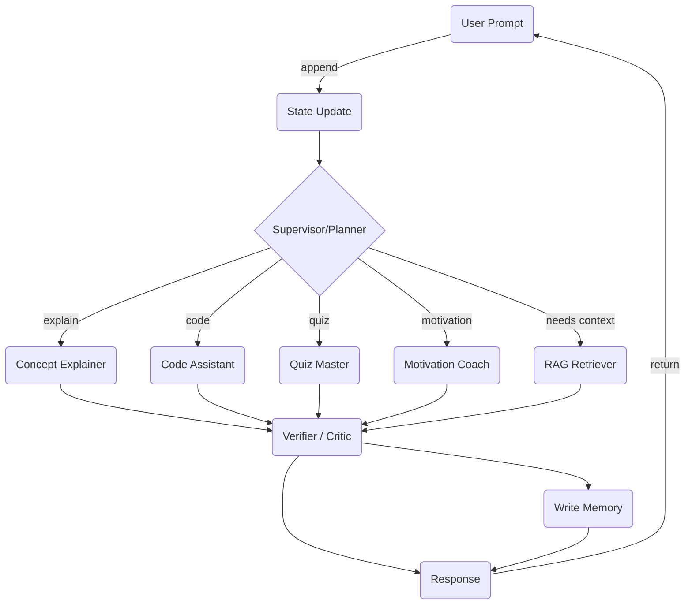

# LangGraph 기반 학습 도우미 설계

## 1. 목표
개별 학습자의 수준, 목표, 학습 선호도에 맞추어 **개인화된** 피드백과 학습 경로를 제안하는 도우미를 구현한다. 
- LangGraph 로 **multi-turn** 대화를 관리하여 문맥을 유지한다.
- **멀티 에이전트** 구조와 **Supervisor Pattern** 을 사용해 다양한 역할(설명, 예제, 퀴즈, 동기부여 등)을 조율한다.
- 장·단기 메모리를 결합해 지속적인 개인화와 회고(Reflection)를 지원한다.

---

## 2. 그래프 상위 구조


- **State Update**: 사용자 메시지를 메시지 히스토리, short-term memory 에 저장.
- **Supervisor/Planner**: 대화 컨텍스트와 사용자 프로필을 고려해 다음 **task**를 결정.
- **전담 에이전트(4종)**: 각 역할에 최적화된 System Prompt 보유. 필요 시 Tool 호출(예: 코딩 실행, 외부 검색).
- **Verifier/Critic**: 출력 품질 확인, 필터링, 토큰 절약.
- **Write Memory**: 장기 메모리(예: vector DB)와 사용자 프로필 업데이트.

---

## 3. 상태(State) 스키마 예시 (TypeScript)
```ts
interface TutorState {
  messages: ChatMessage[];          // 전체 히스토리 (N 최근 메시지만 유지)
  userProfile: {
    id: string;
    level: 'beginner' | 'intermediate' | 'advanced';
    goals: string[];
    preferences: Record<string, any>;
  };
  lessonPlan: LessonStep[];         // 개인화된 학습 경로
  scratchpad: Record<string, any>;  // 노드 간 임시 전달 데이터
  citationDocs?: Document[];        // RAG 결과
  agentResponse?: string;           // 최종 답변 캐시
}
```

---

## 4. 노드 구현 스케치 (Python + LangGraph)
```python
from langgraph import graph, State
from typing import Dict, List

class TutorState(State):
    messages: List[Dict]
    user_profile: Dict
    lesson_plan: List[Dict]
    scratchpad: Dict = {}
    citation_docs: List[Dict] = []

@graph.node
def state_update(state: TutorState, user_input: str):
    state.messages.append({"role": "user", "content": user_input})
    return state

@graph.node
def supervisor(state: TutorState):
    # LLM-based function calling to choose next_task
    task = call_planner_llm(state)
    return task, state

@graph.node
def concept_explainer(state: TutorState):
    response = call_llm("explain", state)
    state.agent_response = response
    return state

# ... 동일 패턴으로 code_assistant, quiz_master, motivation_coach

@graph.node
def verifier(state: TutorState):
    # 취약어 필터링, fact-check, length control
    return state

@graph.node
def write_memory(state: TutorState):
    upsert_vector_db(state.citation_docs)
    upsert_profile(state.user_profile)
    return state

g = graph.DiGraph()
# 노드 및 엣지 연결 (간략)
g.add_edges("state_update", "supervisor")
g.add_edges("supervisor", {
    "explain": "concept_explainer",
    "code": "code_assistant",
    # ...
})
# ... 이하 생략
```

---

## 5. Supervisor Pattern 설계
1. **Planner LLM**: 함수 호출 포맷 ↔ 선택지 \[explain, code, quiz, motivation, retrieve_context].
2. **역할-특화 에이전트**: System Prompt 예시
   - Concept Explainer: "당신은 학생 수준에 맞추어 직관적 예시를 활용해 개념을 설명하는 튜터입니다."
   - Code Assistant: "당신은 전문 프로그래밍 멘토로, 오류를 찾고 예제를 제공합니다."
3. **품질 검증 레이어**: Verifier 가 toxicity, 사실성 등을 체크. 필요 시 재-generate.
4. **Fallback**: Supervisor 가 오류 발생 시 safe_response 노드 호출.

---

## 6. 멀티턴 컨텍스트 & 메모리 전략
- **Short-term**: 최근 N회 대화만 그래프에 유지해 토큰 절감.
- **Long-term**:
  - 사용자 선호/목표는 Key-Value Store.
  - 학습 진행 상황, 성취도는 Relational DB.
  - RAG용 학습 자료는 Vector DB에 저장.
- **Reflection Node(선택)**: 일정 횟수 후, 대화를 요약·분류해 장기 메모리에 저장.

---

## 7. 확장 포인트
- **Tool 노드** 추가: 코드 실행, 웹 서치, 플래시카드 생성.
- **Assessment Loop**: Quiz → 자동 채점 → 다음 레슨 조정.
- **Group Study 모드**: 여러 사용자 State 병합 후 토론 프롬프트 제공.

---

## 8. 결론
Supervisor 기반 멀티-에이전트 LangGraph 구조를 통해 역할 분리를 유지하면서도 개인화·멀티턴 대화를 자연스럽게 처리할 수 있다. 
추가 노드를 손쉽게 삽입할 수 있어 기능 확장성이 높으며, 검증/메모리 레이어로 품질과 지속적인 맞춤형 학습 경험을 보장한다.
