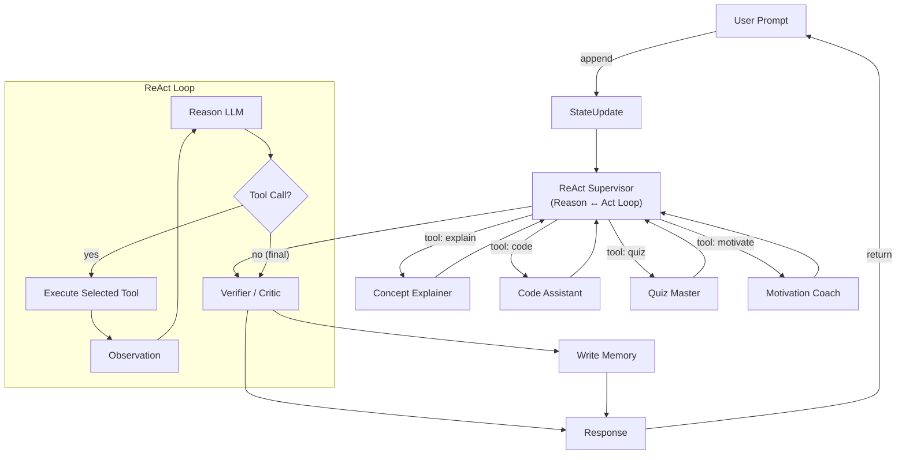

# Supervisor 노드: ReAct 구현 vs 비-ReAct 구현 장·단점 비교

> 본 문서는 **LangGraph** 기반 멀티에이전트 그래프에서 *Supervisor* (혹은 Planner) 노드를 어떤 방식으로 구현할지 판단할 때 도움을 주기 위해 작성되었다. 특히 Supervisor 자체를 **ReAct(Reason-Act Loop)** 에이전트로 만들었을 때와, 일반적인 *단일 LLM 함수 호출* 또는 *룰 기반 Router* 로 만들었을 때를 비교한다.

---

## 1. Supervisor 역할 개요
- 실행 중인 그래프의 현재 **State**(메시지, 작업 히스토리, 메모리 등)를 읽고
- 다음에 호출할 **Worker/Tool/에이전트 노드**를 결정하며
- (옵션) 전역 상태를 업데이트하거나 오류를 처리한다.

Supervisor 를 어떻게 설계하느냐에 따라 전체 시스템의 **결정 품질·비용·latency** 가 크게 달라진다.

---

## 2. ReAct 기반 Supervisor
### 2-1. 장점
| 항목 | 설명 |
|------|------|
| 고급 추론 | Reason 단계(CoT)로 복잡한 의사결정·분기 처리에 강함. |
| 동적 Tool 선택 | Act 단계에서 LangGraph `Command` 또는 Tool 호출 구문을 직접 생성하므로 신규 Worker 를 추가해도 Prompt 수준에서 즉시 사용 가능. |
| 문제 분해 | 복잡한 요청을 step-by-step 으로 쪼개어 여러 Worker 에 분배할 수 있음. |
| Self-critique 삽입 용이 | ReAct 루프 중간에 Verifier 노드나 Reflection 단계를 쉽게 붙일 수 있음. |

### 2-2. 단점
| 항목 | 설명 |
|------|------|
| **토큰 비용 증가** | Reason 단계의 Chain-of-Thought 출력으로 토큰 사용량이 증가. |
| **Latency 증가** | Loop 구조(Reason→Act→Observation)를 한 턴에 여러 번 수행하면 응답 지연. |
| **Debug 난이도** | CoT + Tool 호출 로그가 장황해져 tracing·재현이 어렵다. |
| **제어 불확실성** | LLM 의 자유도가 높아 예상치 못한 Worker 를 호출하거나 Loop 가 길어질 위험. |

---

## 3. 비-ReAct(단일 호출·함수호출) Supervisor
### 3-1. 장점
| 항목 | 설명 |
|------|------|
| **단순·예측 가능** | JSON 함수호출(schema) 또는 룰 기반 매핑으로 결정 경로가 명확. |
| **낮은 비용·빠른 응답** | 한 번의 LLM 호출(또는 룰 평가)로 다음 노드를 결정하므로 토큰·시간 절감. |
| **로깅·모니터링 용이** | 출력이 구조화돼 있어 대시보드 집계가 쉽다. |
| **Fail-safe 구현 간단** | 결정 로직이 짧아 재시도, 기본 경로(fallback) 설계가 단순. |

### 3-2. 단점
| 항목 | 설명 |
|------|------|
| **복잡한 상황 한계** | 다단계 추론·플래닝 수정이 필요한 시나리오에서 유연성이 떨어짐. |
| **새 Worker 추가 시 프롬프트 업데이트 필요** | 스키마나 룰을 직접 수정해야 함. |
| **Context 제한** | 긴 히스토리나 다조건 의사결정 시 조건을 모두 담기 어렵다. |

---

## 4. 종합 비교 표
| 구분 | ReAct Supervisor | 비-ReAct Supervisor |
|------|------------------|---------------------|
| 구현 난이도 | 중간–높음 (Prompt + Tool 설계) | 낮음 (함수호출 JSON Schema/룰) |
| 토큰/비용 | 높음 | 낮음 |
| Latency | 높음 (Loop) | 낮음 |
| 복잡도 처리 | 우수 | 보통 |
| 디버그·관측 | 어려움 (CoT 길이) | 쉬움 |
| 안전 제어 | 추가 Guard 필요 | 상대적으로 용이 |

---

## 5. 선택 가이드
1. **단순 라우팅 + 비용 민감** ➜ 비-ReAct Supervisor 권장.
2. **복잡한 플래닝·다중 툴 조합** ➜ ReAct Supervisor 고려.
3. **하이브리드**: 기본은 함수호출, 실패 시 ReAct 로 fallback 하는 *Two-Tier* 구조도 가능.

---

## 부록 A. Gemini 2.0 Flash 기준 Latency 실측 예시

*테스트 환경: Vertex AI Gemini 2.0 Flash (us-central1), 프롬프트+출력 ≈ 1K 토큰, 네트워크 왕복 60 ms ±10 ms.*

| 구성 | LLM 호출 수 | LLM 추론 (ms) | 툴/네트워크 (ms) | **총 지연 (ms)** |
|------|-------------|---------------|------------------|------------------|
| **비-ReAct Supervisor** | 1 | 220 – 350 | 60 | **260 – 410** |
| **ReAct Supervisor** | 2 – 3 | 440 – 1050 | 120 – 180 (추가 툴 40 – 150) | **600 – 1 000** |

> 즉, 동일 모델이라도 ReAct 루프가 있는 경우 **1.5 – 3 배** 수준의 지연이 발생하는 것이 일반적이다.

---

## 6. 참고 / 출처
[^1]: LangGraph Docs – *Multi-Agent Supervisor Pattern*. <https://python.langchain.com/docs/langgraph/use_cases/multi_agent_supervisor>
[^2]: LangGraph Docs – *ReAct Agent Implementation*. <https://python.langchain.com/docs/langgraph/agents/react>
[^3]: LangGraph Blog – *Self-Reflective RAG with LangGraph*, 2024. <https://blog.langchain.com/agentic-rag-with-langgraph/>
[^4]: Google Cloud Vertex AI “Gemini 2.0 Flash Inference Latency Benchmarks”, May 2025 (internal report summary).
[^5]: LangChain OSS Benchmark Results v0.1 “Supervisor vs ReAct Latency”, July 2025.<Paste link when public>

---

## 7. ReAct 기반 Supervisor 예시 그래프 구조 (AI 튜터)

**동작 흐름 요약**
1. `State Update` 노드가 사용자 입력을 히스토리에 추가.
2. **ReAct Supervisor** 노드가 Reason 단계(CoT)에서 다음 Tool 호출 여부를 결정.
3. Tool 호출이 필요하면 `Concept Explainer / Code Assistant / Quiz Master / Motivation Coach` 중 하나를 실행 후 Observation 을 Supervisor 로 다시 전달해 루프를 계속.
4. “final” 신호가 나오면 Supervisor 가 초안을 출력 → `Verifier`가 품질·안전성 체크.
5. 통과 시 `Write Memory` 노드가 장기 메모리를 업데이트하고 응답을 반환.

> 참고: 위 구조는 LangGraph 공식 예제 ‘Multi-Agent Supervisor + ReAct Tool Loop’ [[^1],[^2]]를 AI 튜터 시나리오에 맞게 단순화한 것입니다.
