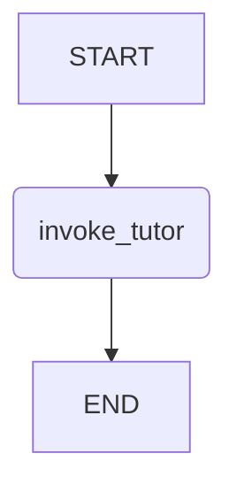

# LangGraph 기반 AI 튜터 그래프 설계

본 문서는 AI 코딩 튜터의 핵심 로직을 담당하는 LangGraph의 구조를 정의합니다. 그래프는 학생과의 상호작용을 관리하고, 상황에 맞는 피드백을 생성하는 역할을 수행합니다.

## 1. 그래프 구조: 단일 노드 모델

복잡성을 줄이고 유지보수성을 높이기 위해, 여러 노드를 거치는 대신 **단일 `invoke_tutor` 노드**를 사용하는 모델을 채택합니다. 이 노드는 학생의 모든 요청을 받아 처리하는 중앙 처리 장치 역할을 합니다.

-   **엣지(Edges):** `START` -> `invoke_tutor` -> `END`

## 2. 상태 (State)

그래프는 대화의 전체 맥락을 관리하기 위해 다음과 같은 상태 필드를 가집니다. 이 상태는 `invoke`가 호출될 때마다 업데이트됩니다.

| 필드명 | 타입 | 설명 | 예시 |
| :--- | :--- | :--- | :--- |
| **`messages`** | `BaseMessage[]` | 학생과 튜터 간의 전체 대화 기록 | `[HumanMessage, AIMessage, ...]` |
| **`current_problem`** | `ProblemContext` | 현재 학생이 풀고 있는 문제 정보 | `{ title: "병합 정렬", description: "..." }` |
| **`current_code`** | `string` | 학생이 에디터에 작성한 현재 코드 | `"def merge_sort(arr): ..."` |
| **`response_to_user`** | `string` | LLM이 생성한 최종 응답 텍스트 | `"좋은 시도네요! ..."` |

## 3. 노드 (Node): `invoke_tutor`

이 노드는 그래프의 핵심 로직을 수행합니다.

### 입력
-   `TutorState`: 현재 그래프의 상태 (위 표 참고)

### 처리 로직
1.  **초기 요청 처리:** 만약 `messages`에 학생의 메시지가 없다면(페이지 첫 로드 시), 미리 정의된 환영 인사를 `response_to_user`에 할당하고 즉시 종료합니다.
2.  **프롬프트 구성:**
    -   `prompts.ts`의 `getTutorSystemPrompt` 함수를 호출합니다. 이 때, `state.current_problem`과 `state.current_code`를 인자로 넘겨 **역할과 컨텍스트가 포함된 동적 시스템 프롬프트**를 생성합니다.
    -   생성된 시스템 프롬프트와 **지금까지의 전체 대화 기록 (`state.messages`)** 을 결합하여, LLM에 전달할 완전한 대화 컨텍스트 배열을 구성합니다. 모델은 단일 프롬프트가 아닌, 이 전체 대화 맥락을 기반으로 응답을 생성합니다.
3.  **LLM 호출:** Google `gemini-2.0-flash` 모델을 호출하여 학생에게 보낼 응답을 생성합니다.
4.  **상태 업데이트:** LLM의 응답을 `response_to_user` 필드에 저장하고, 대화 기록(`messages`)에도 추가합니다.

### 출력
-   `Partial<TutorState>`: 업데이트된 상태 객체

## 4. 프롬프트 설계 (`prompts.ts`)

-   **`getTutorSystemPrompt(problem, code)`**:
    -   AI 튜터의 역할(소크라테스식 대화, 힌트 제공 등)을 정의합니다.
    -   파라미터로 받은 **현재 문제**와 **학생의 코드**를 시스템 프롬프트에 동적으로 삽입하여, AI가 항상 최신 컨텍스트를 기반으로 응답하도록 유도합니다.
-   **`constructUserMessage(message)`**:
    -   학생이 입력한 순수 텍스트 메시지를 `HumanMessage` 객체로 변환하는 역할을 합니다.
