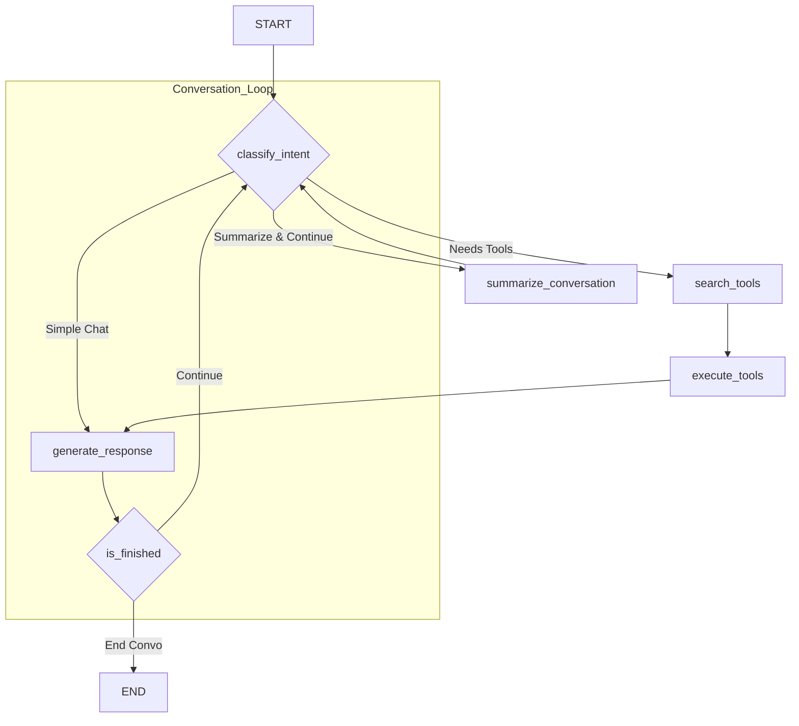

# LangGraph.js를 이용한 장기 대화형 챗봇 그래프 설계

20분 이상 지속되는 장기 대화를 처리할 수 있는 견고한 챗봇을 LangChain.js와 LangGraph로 구현하기 위한 그래프 구조 설계안입니다.

> **주요 출처:**
> - **LangGraph Concepts**: [https://js.langchain.com/docs/langgraph](https://js.langchain.com/docs/langgraph)
> - **LangGraph Persistence**: [https://langchain-ai.github.io/langgraph/concepts/persistence/](https://langchain-ai.github.io/langgraph/concepts/persistence/)
> - **Prompt Templates**: [https://js.langchain.com/docs/modules/model_io/prompts/](https://js.langchain.com/docs/modules/model_io/prompts/)

---

## 1. 설계 목표 및 핵심 과제

장기 대화 챗봇은 다음 세 가지 핵심 과제를 해결해야 합니다.

1.  **상태 관리 (State Management)**: 대화의 전체 맥락, 사용자 정보, 중간 결과물 등을 일관성 있게 추적해야 합니다.
2.  **컨텍스트 압축 (Context Compression)**: LLM의 제한된 컨텍스트 윈도우 내에서 대화의 핵심 정보를 유지해야 합니다.
3.  **동적 흐름 제어 (Dynamic Flow Control)**: 사용자의 다양한 의도(질문, 정정, 주제 변경)에 따라 유연하게 대처해야 합니다.

`LangGraph`는 이러한 과제를 해결하기 위해 **상태 기반 라우팅**과 **지속성(Persistence)** 메커니즘을 제공합니다.

## 2. 제안 그래프 구조

아래는 장기 대화를 처리하기 위해 제안하는 그래프의 시각적 구조입니다.



- **핵심 아이디어**: 모든 사용자 입력은 `classify_intent` 라우터 노드를 통과하여, 현재 상태와 사용자 의도에 따라 가장 적절한 다음 단계(도구 사용, 요약, 일반 응답)로 분기됩니다.

---

## 3. 상태(State) 설계

그래프의 모든 노드가 공유하고 수정할 중앙 데이터 구조인 `State`를 정의합니다.

```typescript
import { BaseMessage } from "@langchain/core/messages";

// LangGraph의 Annotation 기능을 사용하여 상태 필드의 업데이트 방식을 정의합니다.
// https://js.langchain.com/docs/langgraph#annotate-state
export interface LongTermChatState {
  // 전체 대화 기록 (Reducer: 새 메시지를 기존 리스트에 추가)
  messages: BaseMessage[];

  // LLM에 전달할 압축된/단축된 메시지 리스트
  // 이 필드는 매번 덮어써집니다.
  context_window: BaseMessage[];

  // 대화의 실행 요약본 (Reducer: 기존 요약에 새로운 내용을 덧붙임)
  conversation_summary: string;

  // 중간 계산 결과나 도구 출력을 저장하는 임시 공간
  scratchpad: Record<string, any>;

  // 현재 사용자의 의도
  user_intent: "question" | "clarification" | "chitchat" | "end";

  // 대화 턴 카운터 (주기적인 요약을 위해)
  turn_count: number;
}
```

## 4. 노드(Node)별 기능 상세

### 1. `classify_intent` (라우터 노드)

- **역할**: 대화의 흐름을 제어하는 핵심 라우터.
- **입력**: `state.messages`의 마지막 사용자 메시지.
- **처리 로직**:
    1.  LLM을 호출하여 사용자 메시지로부터 의도(`user_intent`)를 추출합니다. (예: `ChatPromptTemplate` 사용)
    2.  `state.turn_count`를 1 증가시킵니다.
    3.  업데이트된 `user_intent`와 `turn_count`를 `State`에 반영하여 반환합니다.
- **출력**: `Partial<LongTermChatState>` (user_intent, turn_count 필드 업데이트)

### 2. `summarize_conversation`

- **역할**: 컨텍스트 윈도우 관리를 위해 주기적으로 대화를 요약.
- **입력**: `state.messages`.
- **처리 로직**:
    1.  `state.messages`에서 최근 N개(예: 10개)의 메시지를 가져옵니다.
    2.  LLM을 호출하여 해당 메시지들을 요약합니다.
    3.  기존 `state.conversation_summary`에 새로운 요약 내용을 추가합니다.
- **출력**: `Partial<LongTermChatState>` (conversation_summary 필드 업데이트)

### 3. `search_tools` & `execute_tools`

- **역할**: RAG, API 호출 등 외부 정보가 필요할 때 도구를 실행.
- **처리 로직**:
    1.  **`search_tools`**: `state.user_intent`와 메시지 내용을 바탕으로 어떤 도구를 사용할지 결정하고, 도구에 맞는 입력을 생성합니다.
    2.  **`execute_tools`**: 결정된 도구를 실행하고, 그 결과를 `state.scratchpad`에 저장합니다.
- **출력**: `Partial<LongTermChatState>` (scratchpad 필드 업데이트)

### 4. `generate_response` (최종 응답 생성)

- **역할**: 모든 정보를 종합하여 사용자에게 전달할 최종 AI 메시지를 생성.
- **처리 로직**:
    1.  LLM에 전달할 컨텍스트(`context_window`)를 준비합니다.
        -   `state.conversation_summary` (전체 맥락)
        -   `state.messages`의 최근 N개 메시지 (최근 맥락)
        -   `state.scratchpad`의 도구 실행 결과 (외부 정보)
        -   사용자의 마지막 질문
    2.  `ChatPromptTemplate`를 사용하여 프롬프트를 구성하고 LLM을 호출합니다.
    3.  생성된 AI 응답을 `state.messages`에 추가합니다.
- **출력**: `Partial<LongTermChatState>` (messages 필드 업데이트)

## 5. 조건부 엣지(Conditional Edges) 로직

- **`classify_intent` 이후**:
    -   `turn_count % 5 === 0` 이면 `summarize_conversation`으로 이동.
    -   `user_intent`가 'question'이고 도구가 필요하면 `search_tools`로 이동.
    -   `user_intent`가 'chitchat'이면 `generate_response`로 바로 이동.
- **`is_finished` 이후**:
    -   `user_intent`가 'end'이면 그래프를 종료(`END`).
    -   그 외의 경우, 다시 `classify_intent`로 돌아가 다음 입력을 대기.

## 6. TypeScript 구현 예시 (골격)

```typescript
import { StateGraph, START, END } from "@langchain/langgraph";
import { LongTermChatState } from "./state"; // 위에서 정의한 state

// --- 각 노드 함수 정의 (async) ---
async function classifyIntent(state: LongTermChatState): Promise<Partial<LongTermChatState>> {
  console.log("1. Classifying intent...");
  // ... LLM 호출하여 의도 분류 및 turn_count 증가 로직 ...
  const intent = "chitchat"; // 예시
  return { user_intent: intent, turn_count: (state.turn_count ?? 0) + 1 };
}

async function generateResponse(state: LongTermChatState): Promise<Partial<LongTermChatState>> {
  console.log("2. Generating response...");
  // ... 컨텍스트 조합 및 LLM 호출로 최종 응답 생성 로직 ...
  const aiMessage = { content: "This is a response." }; // 예시
  return { messages: [aiMessage] };
}

// --- 조건부 엣지 함수 ---
function routeAfterClassification(state: LongTermChatState): "generate_response" | "END" {
  console.log("Routing...");
  if (state.user_intent === "end") {
    return END;
  }
  // 실제로는 더 복잡한 분기 로직 (summarize, tools 등)
  return "generate_response";
}

// --- 그래프 빌드 ---
const workflow = new StateGraph<LongTermChatState>({ channels: { /* state 필드별 reducer 정의 */ } });

workflow.addNode("classify_intent", classifyIntent);
workflow.addNode("generate_response", generateResponse);

workflow.addEdge(START, "classify_intent");

workflow.addConditionalEdges(
  "classify_intent",
  routeAfterClassification,
  {
    "generate_response": "generate_response",
    [END]: END,
  }
);

workflow.addEdge("generate_response", "classify_intent"); // Loop back

// --- 컴파일 및 실행 ---
const app = workflow.compile({ checkpointer: new MemorySaver() });

// const finalState = await app.invoke(
//   { messages: [{ role: "user", content: "Hello!" }] },
//   { configurable: { thread_id: "user-123" } }
// );
```

이 설계안은 장기 대화의 복잡성을 관리하기 위한 확장 가능한 기반을 제공합니다. 실제 프로덕션 환경에서는 각 노드의 프롬프트를 정교하게 튜닝하고, 에러 처리 로직을 추가하며, `MemorySaver` 대신 `PostgresSaver`와 같은 영속적인 Checkpointer를 사용해야 합니다.
